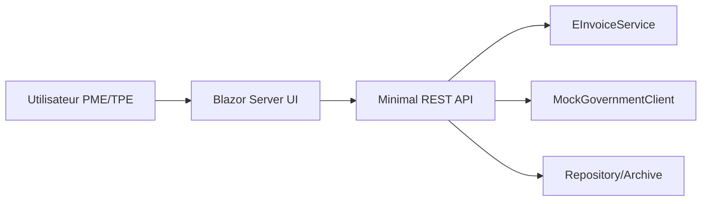

# Architecture Blazor (projet séparé)

## Couches
- **Domain**: entités métiers (`Company`, `Invoice`, `InvoiceLine`, `Submission`, `AuditLog`).
- **Services**: génération XML, signature, QR, numérotation, soumission.
- **Security**: rôles + génération JWT (mock clé locale).
- **UI**: pages Blazor (`Dashboard`, `Invoices`).
- **API**: endpoints REST consommables par apps externes/compta.

## Extension future
- EF Core + PostgreSQL réel.
- Connecteur API fiscale tunisienne réelle.
- Signature PKI réelle (HSM/certificat qualifié).
- Adaptateur Peppol BIS pour Europe.
