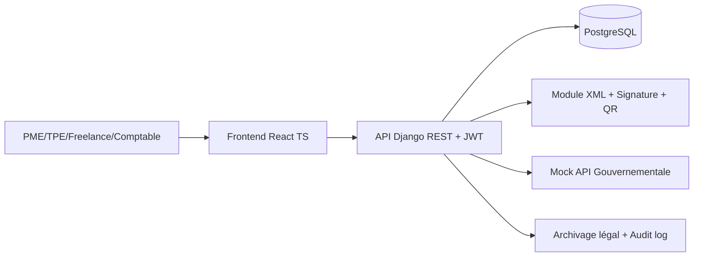

# Architecture globale (MVP e-facturation Tunisie)

## Vue d'ensemble

## Décisions techniques
- **Django + DRF** pour un MVP rapide, robuste, orienté API REST et sécurité.
- **JWT (SimpleJWT)** pour authentification stateless.
- **Multi-tenant logique** via rattachement des données `Company -> owner user` et filtrage strict par propriétaire.
- **Module e-invoicing découplé** (génération XML, signature mock, QR data, soumission) pour préparer l'extension Peppol.
- **Audit log dédié** pour traçabilité réglementaire.

## Modèle de données (résumé)
- `User(role)`
- `Company(owner, tax_id, vat_number, trade_register, certificate)`
- `Invoice(company, number, type, total, status, recurring, ...)`
- `InvoiceLine(invoice, description, qty, vat_rate, line_total)`
- `InvoiceSubmission(invoice, xml_payload, signature, qr_code_data, government_reference, status)`
- `AuditLog(user, action, target, metadata)`

## Flux principal
1. Création facture avec lignes.
2. Génération XML fiscal.
3. Signature électronique (mock SHA-256 + base64).
4. Génération QR data.
5. Envoi vers API gouvernementale mock.
6. Mise à jour statut facture + archivage payload + audit.
